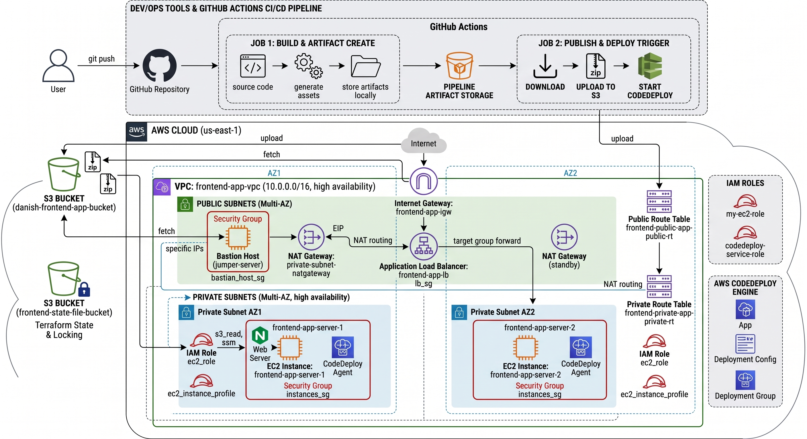
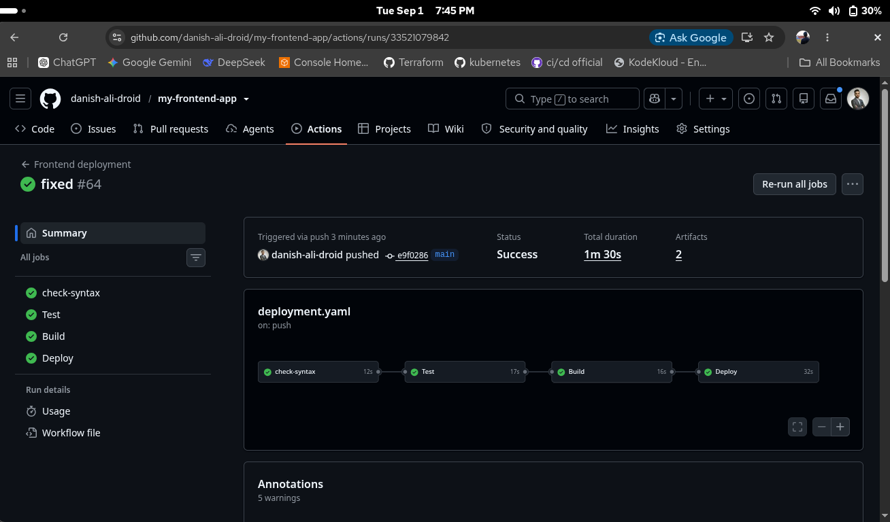
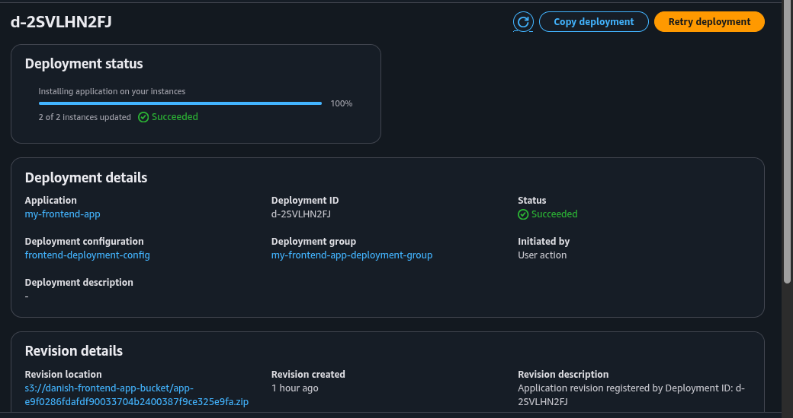
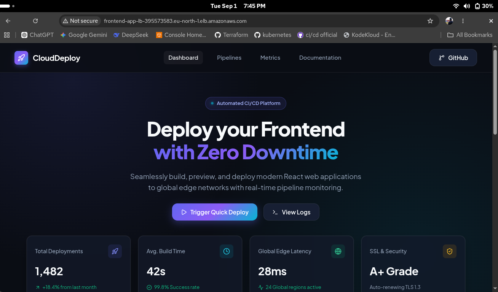
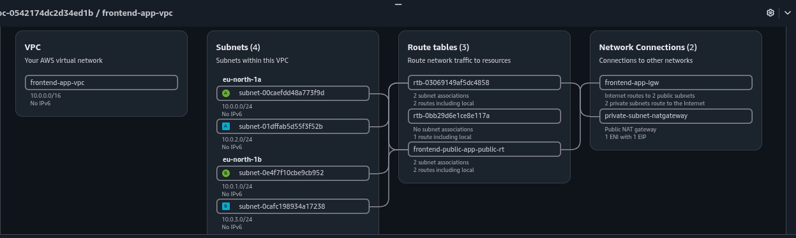
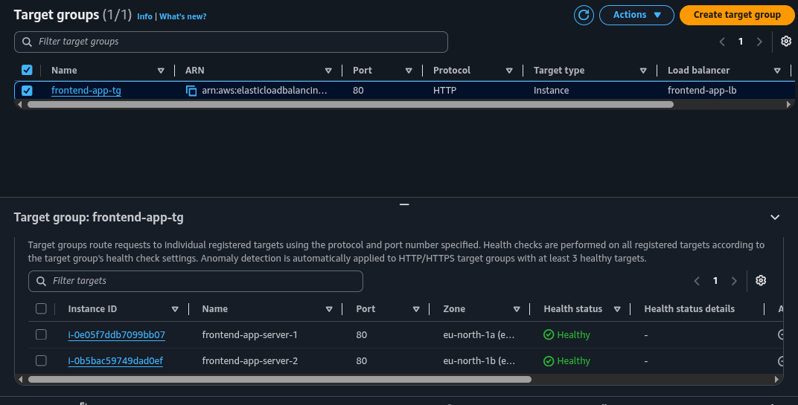
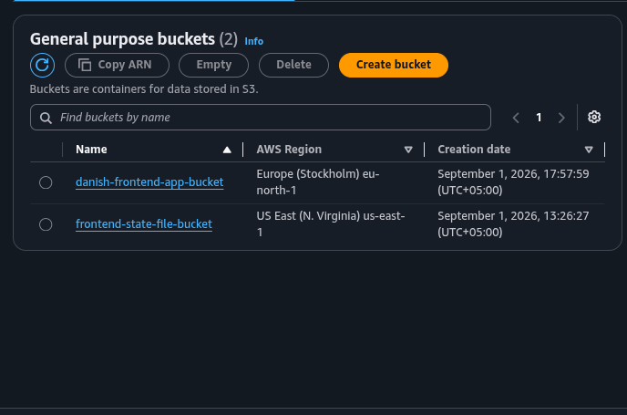

# 🚀 Frontend App Deployment Pipeline

<div align="center">

  


</div>

A modern frontend deployment project built with React, Vite, GitHub Actions, Terraform, AWS EC2, Application Load Balancer, S3, and AWS CodeDeploy. This project demonstrates an end-to-end CI/CD pipeline for deploying a static frontend with secure infrastructure provisioning and automated rollout strategies.

## ✨ Highlights

- Automated CI/CD pipeline with GitHub Actions
- Terraform-managed AWS infrastructure
- VPC, private EC2 instances, public bastion host, and ALB
- S3 artifact storage and CodeDeploy-based deployment
- Production-ready app deployment flow with rollback safety
- Custom deployment script for server-side app restart
- Visual dashboard for app health and deployment analytics

---

## 🏗️ Architecture Overview

This project provisions a resilient AWS environment for frontend hosting and deployment.

- Public-facing Application Load Balancer distributes traffic
- EC2 instances run in private subnets for application hosting
- Bastion host is used for SSH access
- Terraform creates the network, IAM, roles, security groups, and deployment resources
- AWS CodeDeploy handles application deployment lifecycle
- GitHub Actions orchestrates build, test, package, and deploy steps




---

## 📁 Project Structure

```text
frontend-app-deployment/
├── .github/
│   └── workflows/
│       └── deployment.yaml
├── public/
├── scripts/
│   └── deploy.sh
├── src/
│   ├── App.jsx
│   ├── App.css
│   ├── index.css
│   └── main.jsx
├── terraform/
│   ├── backend.tf
│   ├── data.tf
│   ├── iam-role.tf
│   ├── locals.tf
│   ├── main.tf
│   ├── outputs.tf
│   ├── provides.tf
│   ├── user_data.sh
│   ├── variable.tf
│   ├── variable.tfvars
│   └── vpc.tf
├── appspec.yml
├── package.json
├── vite.config.js
├── tsconfig.json
├── pipeline.png
├── deployment.png
├── website.png
├── vpc.png
├── target-group.png
├── s3-bucket.png
├── architecture-diagram.jpeg
├── index.html
├── README.md
└── .gitignore
```

---

## 🔄 Deployment Pipeline

The automation flow is triggered on every push to the main branch and follows this sequence:

1. GitHub Actions checks out the repository
2. Install dependencies and run lint checks
3. Run formatting validation and TypeScript checks
4. Execute tests and upload coverage results
5. Build the frontend application
6. Save build artifacts
7. Configure AWS credentials and initialize Terraform
8. Provision or update AWS infrastructure
9. Package the app with appspec and deployment script
10. Upload the deployment archive to S3
11. Trigger AWS CodeDeploy deployment to EC2 instances

### GitHub Actions workflow

See the automation workflow here: [.github/workflows/deployment.yaml](.github/workflows/deployment.yaml)



<br>



---

## 🌐 AWS Infrastructure

Terraform provisions the complete deployment environment in AWS.

### Core Terraform resources

- VPC and public/private subnets
- Internet Gateway and NAT Gateway
- Security Groups for ALB and EC2
- Application Load Balancer
- Target Group and listener
- S3 bucket for deployment packages
- IAM roles and instance profiles
- CodeDeploy app, configuration, and deployment group

### Terraform files

- [terraform/main.tf](terraform/main.tf)
- [terraform/vpc.tf](terraform/vpc.tf)
- [terraform/iam-role.tf](terraform/iam-role.tf)
- [terraform/backend.tf](terraform/backend.tf)
- [terraform/data.tf](terraform/data.tf)
- [terraform/variable.tf](terraform/variable.tf)
- [terraform/variable.tfvars](terraform/variable.tfvars)
- [terraform/user_data.sh](terraform/user_data.sh)


---

## 🚀 Deployment Configuration

The app uses AWS CodeDeploy with an appspec file to deploy files into the web root and restart the web server.

### AppSpec

See: [appspec.yml](appspec.yml)

```yaml
version: 0.0
os: linux
files:
  - source: /
    destination: /var/www/html
hooks:
  ApplicationStart:
    - location: scripts/deploy.sh
      timeout: 180
      runas: root
```

### Deployment script

See: [scripts/deploy.sh](scripts/deploy.sh)

```bash
#!/bin/bash
systemctl restart nginx
```

This script restarts NGINX after the build files are copied to the EC2 instance.

---

## 🖥️ Frontend Application

This repo includes a React + Vite frontend dashboard representing a deployment console with pipeline activity, status indicators, and deployment logs.

### App entry points

- [src/App.jsx](src/App.jsx)
- [src/index.css](src/index.css)
- [src/main.jsx](src/main.jsx)

### Application preview



A live-style deployment dashboard is shown with:

- deployment metrics cards
- trigger deploy action
- terminal-style logs
- recent deployment list
- feature summary cards

---

## 📸 Screenshots from the project

### Deployment console and workflow status


### AWS CodeDeploy success


### VPC architecture



### App front-end interface


### Target groups 


### S3 Buckets


---

## 🧪 Local Development

### Prerequisites

- Node.js 22+
- npm
- Git
- AWS CLI configured for deployment (if using cloud deployment)
- Terraform installed for infrastructure provisioning

### Install and run locally

```bash
npm install
npm run dev
```

### Production build

```bash
npm run build
```

### Run tests

```bash
npm test
```

### Linting

```bash
npm run lint
```

---

## ☁️ Cloud Deployment Flow

This project is designed for the following full deployment flow:

```text
Developer Push -> GitHub Actions -> Lint/Test/Build -> Package ZIP -> Upload to S3 -> AWS CodeDeploy -> EC2 Instances -> ALB -> Live Frontend
```

### Required GitHub secrets

The workflow expects these secrets to be added in the GitHub repository:

- `ACCESS_KEY_ID`
- `SECRET_ACCESS_KEY`
- `REGION`

These values are used by the AWS credentials action and Terraform provisioning scripts.


---

## ✅ Summary

This repository is a complete demonstration of a cloud-native frontend deployment pipeline. It combines GitHub Actions, Terraform, AWS infrastructure, CodeDeploy automation, and a polished React UI to show how modern release automation can be implemented for production web applications.

---

## 🔗 Related Resources

- [GitHub Actions Workflow](.github/workflows/deployment.yaml)
- [Terraform Infrastructure](terraform/main.tf)
- [AWS Deployment Spec](appspec.yml)
- [Deployment Script](scripts/deploy.sh)
- [React Frontend App](src/App.jsx)

